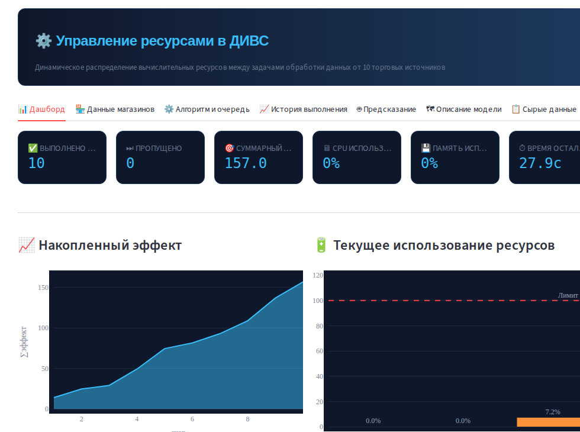
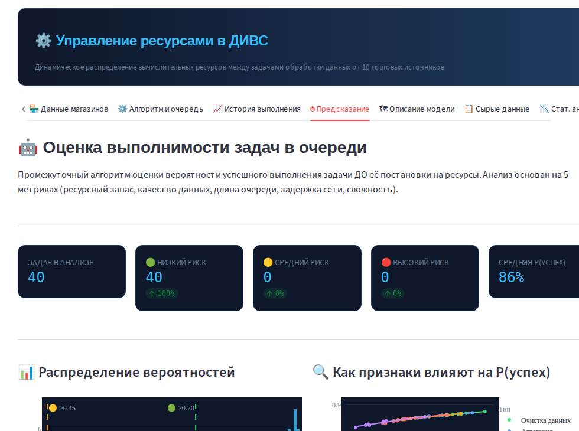
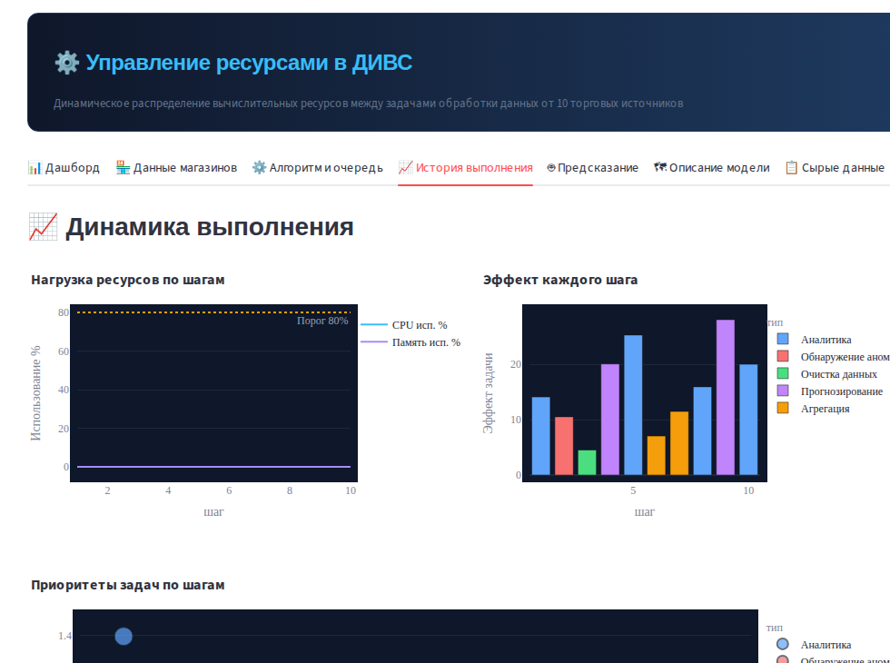
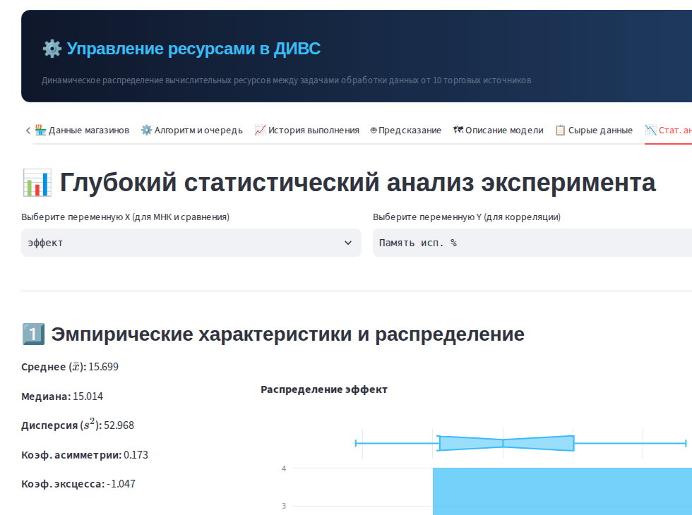

<p align="center">
  
</p>

## What it is

A Streamlit app that simulates a distributed data-processing system. Ten virtual stores send batches of product data; each batch becomes tasks (cleaning, analytics, aggregation, anomaly detection, forecasting) that compete for limited **CPU, memory and time**. The app decides which task to run next, shows the effect of every decision and lets you analyze the experiment statistically.

The point of the project is the decision logic: **how to spend a scarce budget on the tasks with the highest expected value**, which is the same question as prioritizing a product backlog or a marketing budget.

<p align="center"></p>

## How tasks are prioritized

Every task gets a priority score, and at each step the system runs the feasible task with the highest score:

```
priority = efficiency × feasibility × urgency + age_bonus

efficiency  = expected_effect / cost_weight
feasibility = 1.0 if resources are sufficient, 0.1 otherwise
urgency     = f(network delay, noise)
age_bonus   = log(1 + age × 10) × 0.05      # prevents starvation of old tasks
```

CPU and memory are partially released after a task finishes, while time is spent for good. Priorities are recalculated whenever available resources change.

## Predicting success before spending resources

Before a task enters the queue, a feasibility model estimates the probability it will finish successfully. It combines five factors with fixed weights and maps the result to a decision:

| Factor | Weight | Logic |
|---|---|---|
| Resource margin | 0.40 | bottleneck of CPU, memory and time vs task cost |
| Data quality | 0.20 | quality of the source batch (0–1) |
| Queue pressure | 0.15 | `exp(-queue_depth / 40)` |
| Network delay | 0.15 | `1 / (1 + delay / 500)` |
| Complexity | 0.10 | `1 / (1 + weight / 50)` |

`P = sigmoid(6 · Σ wᵢfᵢ − 3)`: run now if P ≥ 0.70, run with monitoring if P ≥ 0.45, otherwise postpone.

<p align="center">
  
  
</p>

## Statistical analysis of the experiment

The last tab treats each simulation run as an experiment and lets you pick any two metrics to analyze:

- descriptive statistics, skewness and kurtosis, distribution and boxplot;
- Shapiro–Wilk normality test with a Q–Q plot;
- linear regression between the selected metrics;
- t-test comparing two data sources;
- CSV export of the full run history.

<p align="center"></p>

## App tabs

| Tab | What it shows |
|---|---|
| Dashboard | KPIs, cumulative effect, current resource usage, task mix |
| Store data | summary by source, price distribution, top products |
| Algorithm & queue | step-by-step execution, queue state with priorities |
| Execution history | load over time, effect per step, heatmap |
| Feasibility | success probability per task, risk buckets, factor impact |
| Model description | formal description of the algorithm and task parameters |
| Raw data | product filters, statistics, CSV export |
| Statistical analysis | tests and regression on the run history |

## Repository structure

```
├── app.py                    # Streamlit app (8 tabs)
├── requirements.txt
├── images/                   # screenshots for this README
└── src/
    ├── data_generator.py     # 10 virtual stores with their own price, volume, quality and network profiles
    ├── task_factory.py       # turns data batches into tasks with cost and expected effect
    └── resource_manager.py   # priority queue, resource pool, feasibility model
```

## How to run

```bash
pip install -r requirements.txt
streamlit run app.py
```

The app opens at http://localhost:8501. Press **▶ Запустить симуляцию** (Run simulation) in the sidebar; the seed field makes runs reproducible.

## Stack

Python · Streamlit · Plotly · pandas · NumPy · SciPy · statsmodels
